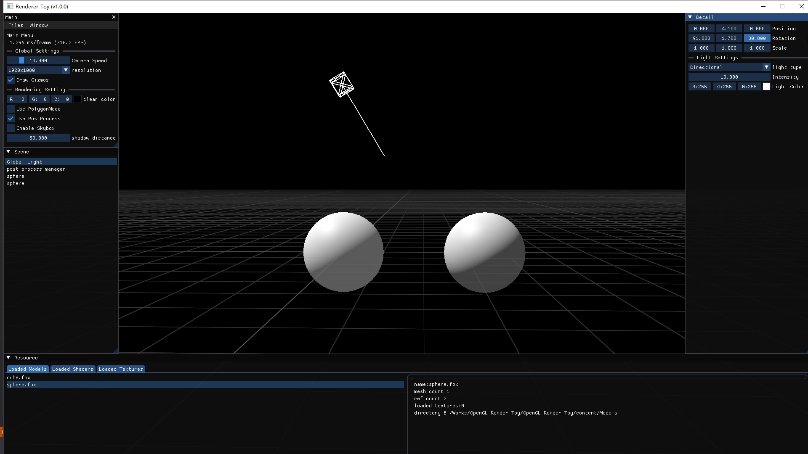
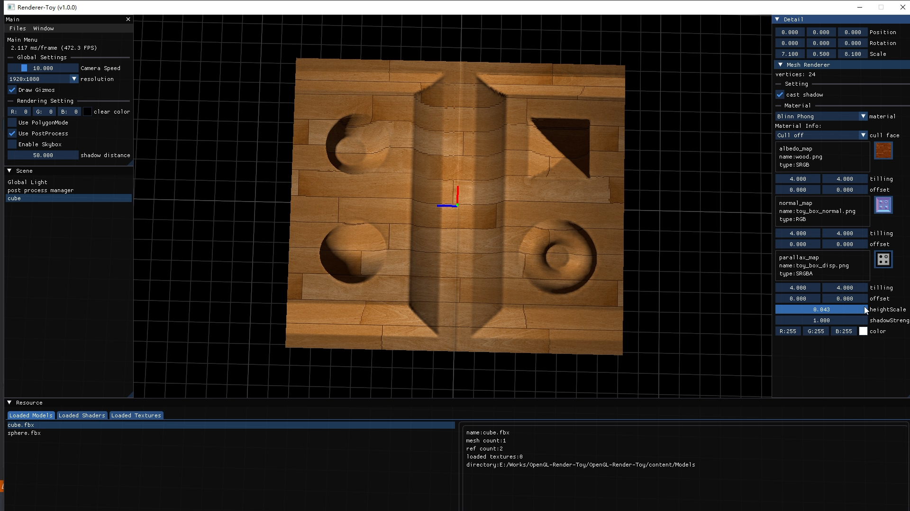
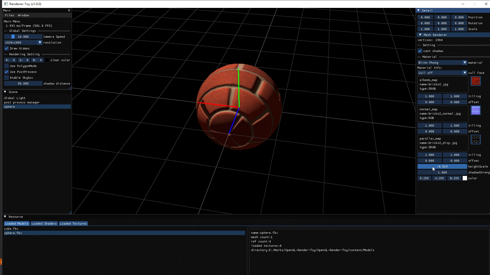
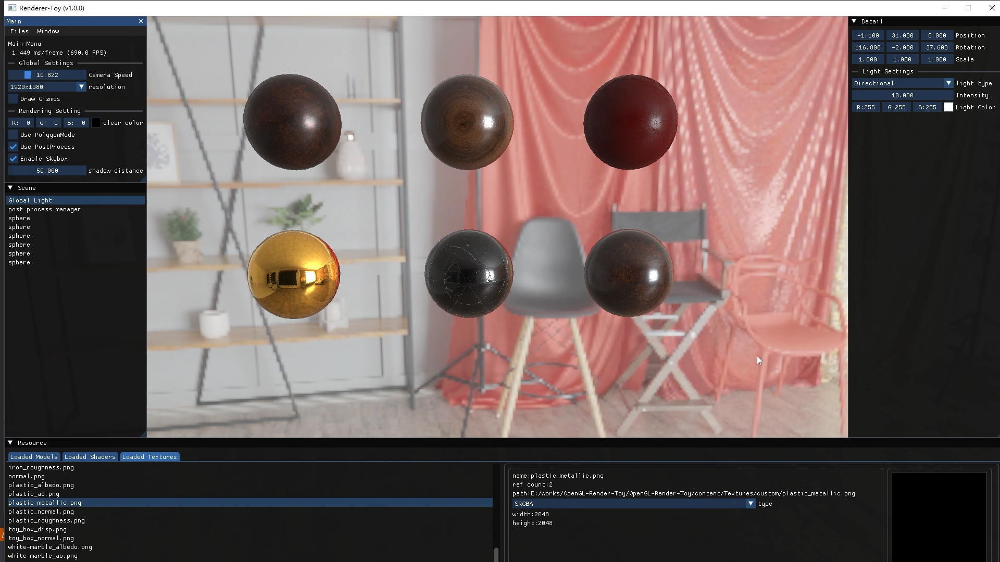
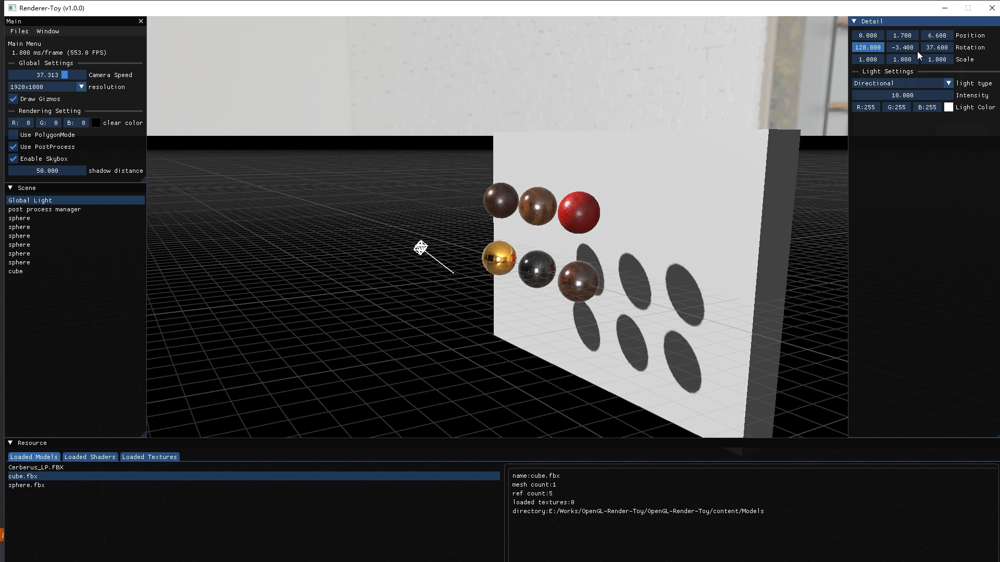
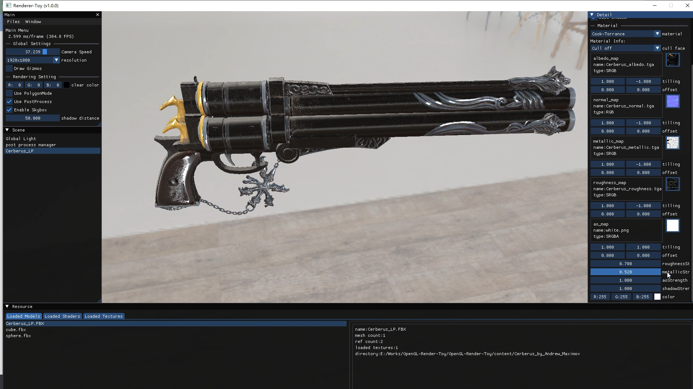

# Overview

# Reference
[LearnOpenGL](https://learnopengl.com/)

[OpenGLRenderer](https://github.com/NOTSEABASS/OpenGLRenderer)

[imgui](https://github.com/ocornut/imgui)

[Assimp](https://github.com/assimp/assimp)

[glfw](https://github.com/glfw/glfw)

[stb](https://github.com/nothings/stb/tree/master)
